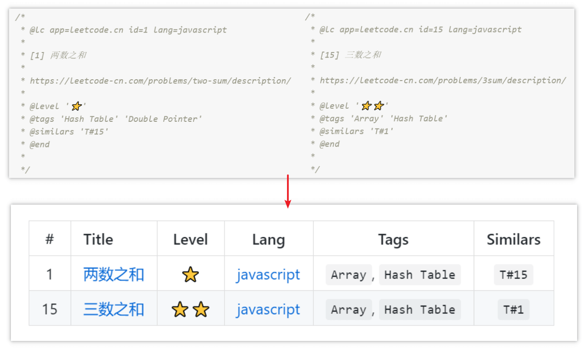

# TBuilder

语言：[English](./README.md) | [中文简体](./README-zh_CN.md)

## 🔮 什么是 TBuilder？



## ✨ 示例

这里有一些文件：

```
~- source
   ├─ demo1.js
   └─ demo2.js
```

`demo1.js`

```js
/*
 * @lc app=leetcode.cn id=1 lang=javascript
 *
 * [1] 两数之和
 *
 * https://leetcode-cn.com/problems/two-sum/description/
 *
 * @level '⭐'
 * @tags 'Hash Table' 'Double Pointer'
 * @similars 'T#15'
 * @end
 *
 */
```

`demo2.js`

```js
/*
 * @lc app=leetcode.cn id=15 lang=javascript
 *
 * [15] 三数之和
 *
 * https://leetcode-cn.com/problems/3sum/description/
 *
 * @level '⭐⭐'
 * @tags 'Array' 'Hash Table'
 * @similars 'T#1'
 * @end
 *
 */
```

TBuilder 可以使用 `@XX` 标记，来自动生成表格数据：


## 📃 文档

- **`new TBuilder(opts)`**

  |参数|说明|类型|必选|默认值|
  |:--|:--|:--:|:--:|:--:|
  |`opts.overwrite`|是否覆盖旧的数据|boolean|否|`true`|
  |`opts.signs`|需要解析的标记|array|否|`['id', 'title', 'level', 'lang', 'tags', 'similars']`|
  |`opts.thead`|表格头代码（Markdown 语法）|string|否|`|#|Title|Level|Lang|Tags|Similars|\n|:---:|:---|:---:|:---:|:---:|:---:|`|
  |`opts.marker.start`|开始定位标记|string|否|`<!-- @tb-start -->`|
  |`opts.marker.end`|终止定位标记|string|否|`<!-- @tb-end -->`|

- `build(sourceFile, outputFile)`

  解析注释中的标记，生成表格数据。

  |参数|说明|类型|必选|默认值|
  |:--|:--|:--:|:--:|:--:|:--:|
  |`sourceFile`|需要解析的文件路径|string|是|-|
  |`outputFile`|存储生成数据的文件的路径|string|否|`./README.md`|

## 🔨 使用

- 基础用法

  ```js
  const TBuilder = require('TBuilder');
  const tbuilder = new TBuilder();

  tbuilder.build('./source/');
  ```

- 指定表格头

  ```js
  const TBuilder = require('TBuilder');
  const tbuilder = new TBuilder({
    signs: ['id', 'title'],
    thead: '|#|Title|\n|:---:|:---:|',
  });

  tbuilder.build('./source/');
  ```

- 指定定位标记

  ```js
  const TBuilder = require('TBuilder');
  const tbuilder = new TBuilder({
    marker: {
      start: '// @tb-start',
      end: '// @tb-end',
    },
  });

  tbuilder.build('./source/');
  ```

- 指定输出文件

  ```js
  const TBuilder = require('TBuilder');
  const tbuilder = new TBuilder();

  tbuilder.build('./source/', './table.md');
  ```

## 🤝 开源协议

[MIT](https://github.com/liuyib/tbuilder/blob/master/LICENSE)
