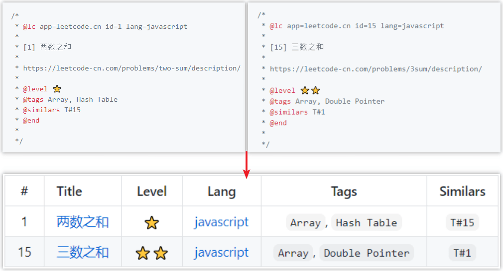

# TableGT

语言：[English](./README.md) | [中文简体](./README-zh_CN.md)

## 🔮 什么是 TableGT？



## ✨ 示例

这里有一些文件：

```
demo 
  ├─ source
  |  ├─ demo1.js
  |  └─ demo2.js
  └─ index.js
```

`demo1.js`

```js
/*
 * @lc app=leetcode.cn id=1 lang=javascript
 *
 * [1] 两数之和
 *
 * https://leetcode-cn.com/problems/two-sum/description/
 *
 * @level '⭐'
 * @tags 'Hash Table' 'Double Pointer'
 * @similars 'T#15'
 * @end
 *
 */
```

`demo2.js`

```js
/*
 * @lc app=leetcode.cn id=15 lang=javascript
 *
 * [15] 三数之和
 *
 * https://leetcode-cn.com/problems/3sum/description/
 *
 * @level '⭐⭐'
 * @tags 'Array' 'Hash Table'
 * @similars 'T#1'
 * @end
 *
 */
```

`index.js`

```js
const TableGT = require('tablegt');
const tablegt = new TableGT();

tablegt.build('./source');
```

在 `demo` 目录下，执行 `node index.js`，此时该目录下会生成一个 `README.md` 文件，文件中的内容如下：


其中 TableGT 使用代码注释中的 `@XX` 标记，来生成表格数据。

## 📃 文档

- **`new TableGT(opts)`**

  | 参数 | 说明 | 类型 | 必选 | 默认值 |
  | :--- | :--- | :---: | :---: | :---: |
  | `opts.overwrite` | 是否覆盖旧的数据 | boolean | 否 | `true` |
  | `opts.signs` | 需要解析的标记 | array | 否 | `['id', 'title', 'level', 'lang', 'tags', 'similars']` |
  | `opts.thead` | 表格头代码（Markdown 语法） | string | 否 | `\| # \| Title \| Level \| Lang \| Tags \| Similars \|\n\| :---: \| :--- \| :---: \| :---: \| :---: \| :---: \|` |
  | `opts.marker.start` | 开始定位标记 | string | 否 | `<!-- @tb-start -->` |
  | `opts.marker.end` | 终止定位标记 | string | 否 | `<!-- @tb-end -->` |

- `build(source, target)`

  解析注释中的标记，生成表格数据。

  | 参数 | 说明 | 类型 | 必选 | 默认值 |
  | :--- | :--- | :---: | :---: | :---: |
  | `source` | 需要解析的文件路径 | string | 是 | - |
  | `target` | 存储生成数据的文件的路径 | string | 否 | `./README.md` |

## 🔨 使用

- 基础用法

  ```js
  const TableGT = require('tablegt');
  const tablegt = new TableGT();

  tablegt.build('./source/');
  ```

- 指定表格头

  ```js
  const TableGT = require('tablegt');
  const tablegt = new TableGT({
    signs: ['id', 'title'],
    thead: '| # | Title |\n| :---: | :---: |',
  });

  tablegt.build('./source/');
  ```

- 指定定位标记

  ```js
  const TableGT = require('tablegt');
  const tablegt = new TableGT({
    marker: {
      start: '// @tb-start',
      end: '// @tb-end',
    },
  });

  tablegt.build('./source/');
  ```

- 指定输出文件

  ```js
  const TableGT = require('tablegt');
  const tablegt = new TableGT();

  tablegt.build('./source/', './table.md');
  ```

## 🤝 开源协议

[MIT](https://github.com/liuyib/tablegt/blob/master/LICENSE)
