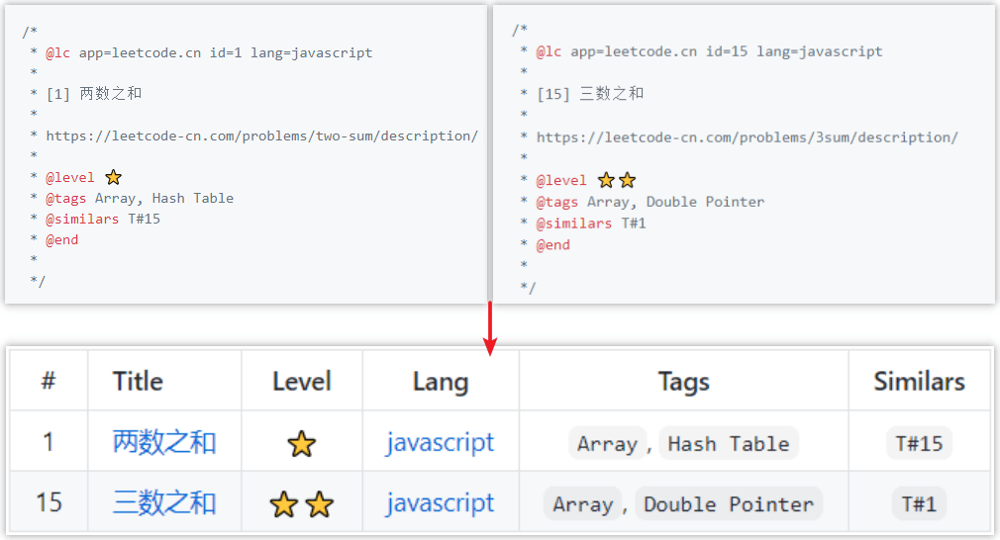
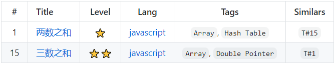

# TableGT

Languages: [English](./README.md) | [中文简体](./README-zh_CN.md)

## 🔮 What is TableGT?



## ✨ Example

There are some files:

```
demo 
  ├─ source
  |  ├─ demo1.js
  |  └─ demo2.js
  └─ index.js
```

`demo1.js`

```js
/*
 * @lc app=leetcode.cn id=1 lang=javascript
 *
 * [1] 两数之和
 *
 * https://leetcode-cn.com/problems/two-sum/description/
 *
 * @level ⭐
 * @tags Array, Hash Table
 * @similars T#15
 * @end
 *
 */
```

`demo2.js`

```js
/*
 * @lc app=leetcode.cn id=15 lang=javascript
 *
 * [15] 三数之和
 *
 * https://leetcode-cn.com/problems/3sum/description/
 *
 * @level ⭐⭐
 * @tags Array, Double Pointer
 * @similars T#1
 * @end
 *
 */
```

`index.js`

```js
const TableGT = require('tablegt');
const tablegt = new TableGT();

tablegt.build('./source');
```

In the `demo` directory, run `node index.js`, and a `README.md` file will be generated. The contents of the file are as follows:



## 🔨 Usage

- Basic usage

  ```js
  const TableGT = require('tablegt');
  const tablegt = new TableGT();

  tablegt.build('./source/');
  ```

- Advanced usage

  > Please read the documentation before reading the **advanced usage** section.

  - Specify signs and table header

    ```js
    // The signs and thead parameters must be configured at the same time, see the documentation for details.
    const tablegt = new TableGT({
      signs: ['lc_id', 'lc_title'],
      thead: '| # | Title |\n| :---: | :---: |',
    });
    ```

  - Custom signs and table header

    ```js
    const tableget = new TableGT({
      // The @foo, @bar, @baz signs will be matched.
      signs: ['foo', 'bar', 'baz'],
      thead: '| Foo | Bar | Baz |\n| :---: | :---: | :---: |',
    });
    ```

  - Specifies a delimiter for the table generation location

    ```js
    const tablegt = new TableGT({
      marker: {
        start: '// @tb-start',
        end: '// @tb-end',
      },
    });
    ```

  - Specify output file

    ```js
    tablegt.build('./source/', './table.md');
    ```

## 📃 Documentation

TableGT will parse the comment blocks beginning with `/*` in the file (Note: comment blocks beginning with `/**`, `/***`, `...` will be ignored), and match the `@XXX` mark in it, and split the string after mark into multiple keywords to generate a table.

- **`new TableGT(opts)`**

  | Parameter | Description | Type | Required | Default value |
  | :--- | :--- | :---: | :---: | :---: |
  | `opts.overwrite` | whether to overwrite old data | boolean | `false` | `true` |
  | `opts.signs` | signs that needs to be parsed (If this parameter is specified manually, you must also specify the `thead` parameter manually) | array | `false` | `['lc_id', 'lc_title', 'level', 'lc_lang', 'tags.comma.code', 'similars.comma.code' ]` |
  | `opts.thead` | the code of table header (Markdown syntax. This parameter only needs to be configured when the `signs` parameter is manually specified) | string | `false` | `\| # \| Title \| Level \| Lang \| Tags \| Similars \|\n\| :---: \| :--- \| :---: \| :---: \| :---: \| :---: \|` |
  | `opts.marker` | delimiter for table generation location | object | `false` | - |
  | `opts.marker.start` | the start position of the table generation | string | `false` | `<!-- @tb-start -->` |
  | `opts.marker.end` | the end position of the table generation | string | `false` | `<!-- @tb-end -->` |

  The supplementary description of some of these parameters is as follows:

  - `opts.signs`

    The built-in optional values are `lc_id`、`lc_title`、`lc_lang` 、`level`、`tags`、`similars`. In addition, you can customize the signs that needs to be parsed, as long as your custom signs don't have the same name as the built-in signs.

    The `lc_` is a specific prefix. Those beginning with `lc_` can only be used for comment blocks generated by [vscode-leetcode](https://github.com/LeetCode-OpenSource/vscode-leetcode). Those without `lc_` will be used to match `@XXX` signs (e.g. If `level` is set, the `@level` sign will be matched).

    In addition, you can add modifiers to the parameter item to specify how to split the string after the sign into multiple keywords. For details, see **documentation - modifier**

  - `opts.thead`

- `build(source, target)`

  Parse the signs in the comments to generate tabular data.

  | Parameter | Description | Type | Required | Default value |
  | :--- | :--- | :---: | :---: | :---: |
  | `source` | The path of the file that needs to be parsed | string | `true` | - |
  | `target` | The file path to store the generated data | string | `false` | `./README.md` |

- Modifier

  By default, TableGT will use `,` as the delimiter to split the string after the sign into multiple keywords. You can add modifiers to the item of `opts.signs` parameter to render the keywords into other formats.

  The optional modifiers are as follows:

  - `raw`

    **Effect**: Nothing is done to the string after the sign.

    **Optional**: Yes.

    **Note**: Even with the `raw` modifier, it is not allowed to use `@` in the string after the sign.

    **Example**:

    ```js
    const tableget = new TableGT({
      signs: ['test.raw'],
      thead: '| Test |\n| :---: |',
    });

    // The comment to be parsed are as follows:
    /*
     * @test my-test1,,,my-test2,,,
     */

    // After parsing, the original data output to the table is "my-test1,,,my-test2,,,"
    ```

  - `code`

    **Effect**: Wrap the separated keywords in back quotes (In this way, the keywords will be displayed in Markdown in the style of inline code blocks).

    **Optional**: Yes.

    `Usage`:

      1. It can only be used to modify the items in `opts.signs` without a specific prefix (`xxx_`).
      2. When used with `comma` and `quote` modifiers, the `code` modifier must be placed behind.

  - `comma`

    **Effect**: Use half-corner comma (`,`) as separator to split the string after the sign into multiple keywords.

    **Optional**: Yes. (If no modifier is specified, `comma` will be the default value)

    Example:

    ```js
    const tableget = new TableGT({
      signs: ['test.comma.code'],
      thead: '| Test |\n| :---: |',
    });

    // The comment to be parsed are as follows:
    /*
     * @test my-test1, my-test2
     */

    // After parsing, the original data output to the table is "`my-test1`, `my-test2`"
    // As you can see, the keywords 'my-test1' and 'my-test2' are separated by half-corner comma and wrapped in back quotes.
    ```

  - `quote`

    Effect: Use paired quotation marks (either single or double quotation marks) as delimiters to split the string after the sign into multiple keywords.

    Optional: Yes.

    Example 1:

    ```js
    const tableget = new TableGT({
      signs: ['test.quote'],
      thead: '| Test |\n| :---: |',
    });

    // The comment to be parsed are as follows:
    /*
     * @test 'my-test1' 'my-test2'
     */

    // After parsing, the original data output to the table is "my-test1, my-test2"
    // As you can see, the keywords 'my-test1' and 'my-test2' are separated by quote and connected with comma + space.
    ```

    Example 2:

    ```js
    const tableget = new TableGT({
      signs: ['test.quote.code'],
      thead: '| Test |\n| :---: |',
    });

    // The comment to be parsed are as follows:
    /*
     * @test 'my-test1' 'my-test2'
     */

    // After parsing, the original data output to the table is "`my-test1`, `my-test2`"
    // As you can see, the keywords 'my-test1' and 'my-test2' are separated by quote and wrapped in back quotes.
    ```

## 🤝 LICENSE

[MIT](https://github.com/liuyib/tablegt/blob/master/LICENSE)
